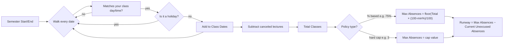
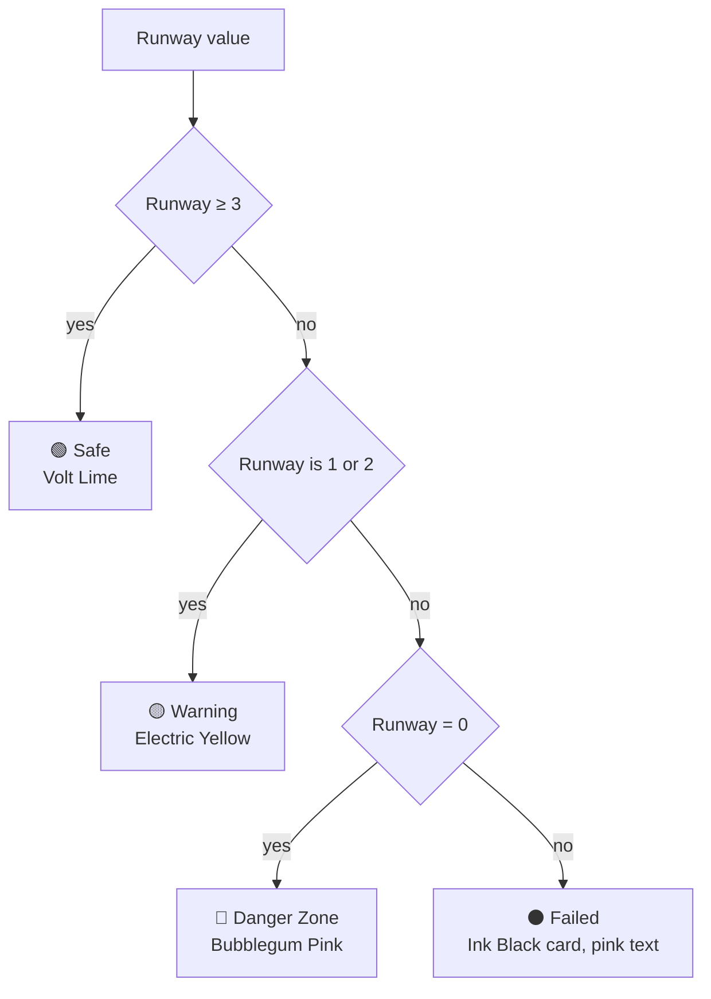

# 🪑 BENCH

### *"Track your seat time."*

We all have skip class. The problem was I never knew **how much** I was allowed to skip before I actually got in trouble for it — so I built the thing that tells me.

BENCH is a loud, on-purpose,  attendance calculator. You give it your schedule and your school's attendance policy, and it tells you exactly how many benches (lectures) you have left before you fail the course on attendance alone. No vibes, no guessing, just math.


## why this exists

Every attendance tracker I found online was either a spreadsheet someone's cousin made in 2014, or some SaaS-flavored app that wanted my email to tell me I'm "on track 🎉". I didn't want encouragement. I wanted a number. A cold, exact, don't-lie-to-me number.

So: BENCH doesn't estimate. It walks your actual semester calendar day by day, skips the holidays, skips the canceled lectures, respects your excused medical absences, and gives you a runway — like a fuel gauge, except the fuel is your ability to not show up.

<br>

## what it actually looks like


```
+-----------------------------------------------------------------------+
|  [ BENCH ]  "Track your seat time."              [ + NEW SUBJECT ]     |
+-----------------------------------------------------------------------+
|  [ OPERATING SYSTEMS ]                            [ SAFE: 3 LEFT ]    |
|  Dr. Alexander Cooper | Room Tech 302                                 |
|  +-----------------------------------------------------------------+  |
|  |                        3 BENCHES LEFT                           |  |
|  +-----------------------------------------------------------------+  |
|  Timeline (85%) [=======================.................]            |
+-----------------------------------------------------------------------+
```

Heavy borders. Hard drop shadows. Grid-paper background. Numbers in a monospace font because numbers deserve respect. Nothing about this app is subtle, and that's on purpose — when your runway hits zero, you should *feel* it.

<br>

## how the math works

This is the part I actually care about. No rounding, no "roughly 3 more absences" — real date arithmetic.



And the status your subject card shows is just a lookup on that runway number:



Excused absences (medical notes, official excuses) never touch this number — they're logged, they're visible, they just don't count against you. That distinction alone is the reason I didn't just use a Google Sheet.

<br>

## features, roughly in the order I built them

- [x] **Subject setup** — course name, professor, room, semester start/end, and a day/time matrix so you can say "Mondays 10am + Wednesdays 2pm" without fighting a UI
- [x] **Policy picker** — minimum attendance % *or* a hard absence cap, whichever your school actually uses
- [x] **Runway dashboard** — the big dumb counter that's the whole point of this app
- [x] **Matrix calendar** — click a class cell to cycle it: attended → skipped → canceled → back to blank
- [x] **Excuse system** — striped pink cells for excused absences, exempt from the math
- [x] **Global timeline** — every course, every day, one grid, so you can see your whole semester's damage at once
- [x] **.ics export** — dumps your whole schedule into a calendar file for Google/Apple/Outlook
- [x] **Threshold alerts** — toast popup + browser notification the moment you hit 1 or 0 skips left
- [x] **Offline-first** — everything lives in `localStorage`, no backend, no account, no tracking

<br>

## the stack (kept it small on purpose)

| Layer | Choice | Why |
|---|---|---|
| Framework | React 19 + Vite | fast dev loop, nothing fancy |
| Styling | Plain CSS design tokens | Tailwind felt like overkill for something this opinionated |
| State | React hooks + `localStorage` | one user, one browser, no server needed |
| Calendar math | Vanilla `Date` logic | no date library, just careful loops over the semester range |
| Fonts | Space Grotesk / Plus Jakarta Sans / Space Mono | headers, body, numbers — each doing one job |

<br>

## file map

```
bench/
├── index.html          → app shell + meta tags
├── package.json         → Vite + React 19
├── src/
│   ├── main.jsx          → mounts <App />
│   ├── index.css         → 
│   ├── App.jsx           → state, math engine, modals, calendar grids
│   └── mockData.js       → demo subjects so the app isn't empty on first load
```

<br>

## running it locally

```bash
git clone https://github.com/yourname/bench.git
cd bench
npm install
npm run dev
```

Open the local URL it gives you, hit **+ NEW SUBJECT**, and start telling it the truth about your schedule.

<br>

## color palette, because it matters here

| swatch | name | hex | used for |
|---|---|---|---|
| 🟨 | Electric Yellow | `#FFE600` | branding, warning state |
| 🩷 | Bubblegum Pink | `#FF6B8B` | danger, absences, alerts |
| 🟩 | Volt Lime Green | `#A3E635` | safe state, main CTAs |
| 🟦 | Sky Blue | `#38BDF8` | active courses, export actions |
| ⬛ | Ink Black | `#111111` | text, borders, shadows |
| ⬜ | Off-White Grid | `#F4F4F0` | canvas background |

<br>

## honest limitations

- It's fully client-side, so if you clear your browser data, your semester goes with it. Export your `.ics` if you care about keeping the schedule.
- No multi-device sync yet. It's a bench, not a cloud.
- If your school's attendance policy is weirder than "% based" or "hard cap" (rolling windows, per-assignment weighting, whatever), it's not modeled yet.

<br>

## why "bench"

Because when you skip class, you're on the bench. Simple as that.

<br>

---

Made by someone who has, at time of writing, 1 bench left in Operating Systems. Wish me luck.

